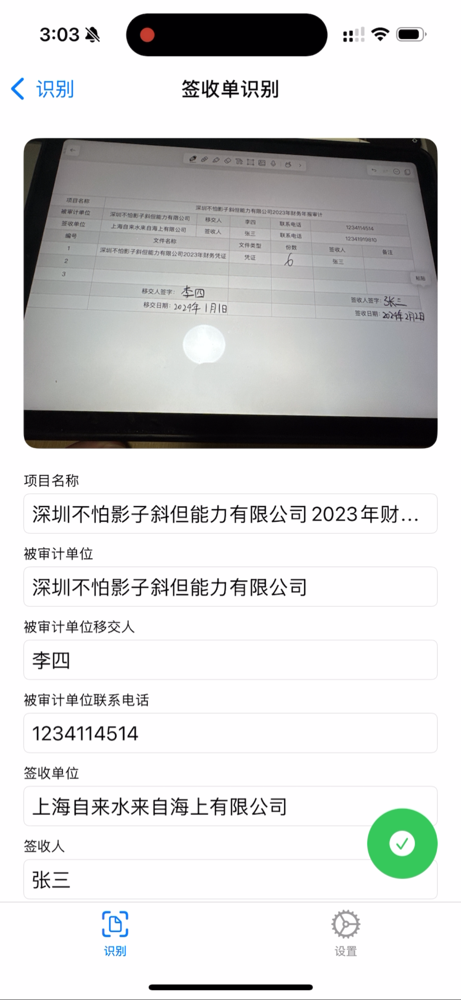

# EasyReceipt 易收据🧾

财务的朋友有福了！

这是一个可以扫描收据图片并同步至飞书文档的 iOS 应用。使用 Dify 对多模态模型进行编排。

<div style="display:flex; flex-direction:row; align-items:center; justify-content:space-around">
    
    
    
</div>

## Todo

- [ ] i18n

- [ ] UI

- [ ] 上架 TestFlight

## Usage

0. 从 TestFlight 安装

1. 克隆本项目

```
git clone https://github.com/stvlynn/EasyReceiptSwift.git
```

2. 在 Xcode 中打开 EasyReceiptSwift.xcworkspace

3. 插入设备并编译


## Frontend

## Backend

[Deploy to Dify](/EasyReceiptDify.yml)

## Sponsoring

[](https://www.buymeacoffee.com/stvlynn)

[](https://github.com/sponsors/stvlynn)


ETH: 0xEbf67cd24fa23fde69843cA4119cE946d8c231F5

## License

[AGPL-3.0](./LICENSE)